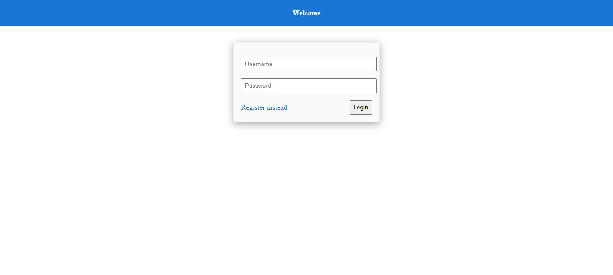
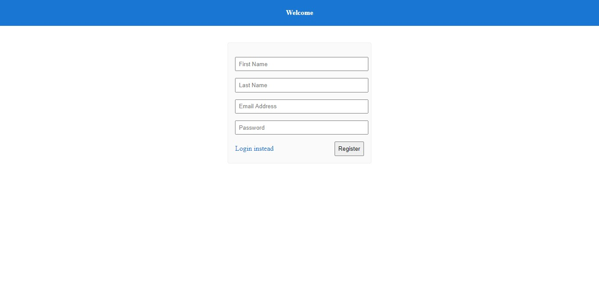
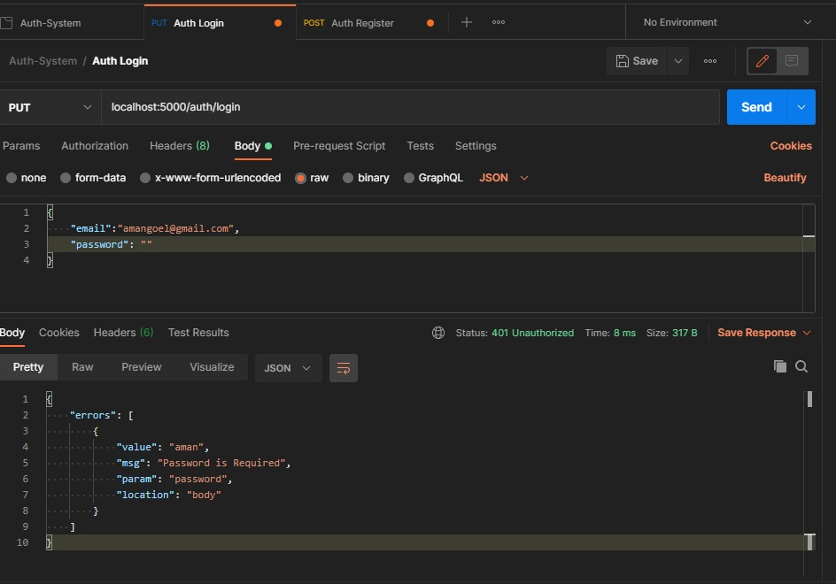

# Authentication-System using MEAN

This is a full fledged Authentication System built on MEAN tech Stack. I have implemented JWT authentication on backend and made use of Mongo DB for persistence.


## Starting the Application
Initially you would require to connect Mongo DB server by inserting the DB URI in `auth-server/config/default.json` file.
```shell
$ cd auth-server && npm start
$ cd auth-client && npm start
```

## Screenshots
1. Login Page


---

2. Register Page


---

3. API Testing
